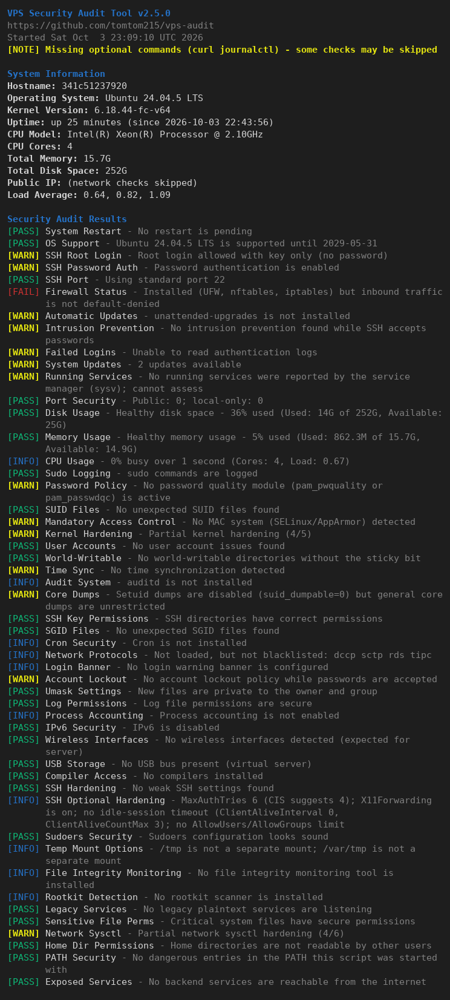
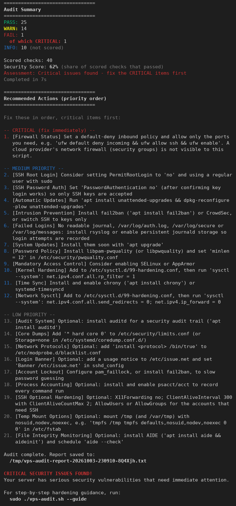

# VPS Audit

[](https://github.com/tomtom215/vps-audit/actions/workflows/ci.yml)
[](LICENSE)

**Find out what to fix first on a Linux server.** `vps-audit.sh` is a single Bash
file that inspects a VPS, prints what passed and what did not, and ends with a
prioritised to-do list. It is read-only: it never changes your configuration.

Run it right after you receive a new server's credentials, and again after you
harden it.



<sub>A real run inside an Ubuntu 24.04 container with the packages from
`tests/container/setup.sh` (OpenSSH, ufw, nftables, iptables), 80 columns wide,
with `--no-network`. A real server's results will differ.</sub>

## What it does

- Runs **54 checks in 24 categories**: SSH, firewall, updates, intrusion
  prevention, accounts, file permissions, kernel hardening, Docker, and more
  ([full list](#what-is-checked)).
- Reports each as `PASS`, `WARN`, `FAIL` or `INFO`, then lists the fixes in
  priority order, each saying what to change and to which value.
- Understands how current servers are really configured: nftables and Docker's
  firewall rules, `sshd_config.d` drop-ins, journald-only logging, sudo-rs,
  merged-`/usr`, containers without systemd.
- Writes a text report and/or a JSON report (mode `600`) and sets an exit code,
  so it works from cron and monitoring.

## Quick start

```bash
# Download a release and verify it
curl -fsSLO https://github.com/tomtom215/vps-audit/releases/latest/download/vps-audit.sh
curl -fsSLO https://github.com/tomtom215/vps-audit/releases/latest/download/SHA256SUMS
sha256sum -c SHA256SUMS
chmod +x vps-audit.sh

sudo ./vps-audit.sh              # run every check
sudo ./vps-audit.sh --guide      # step-by-step hardening for a brand-new VPS
```

The release workflow publishes `SHA256SUMS` and a build-provenance attestation
with each release: `gh attestation verify vps-audit.sh --repo tomtom215/vps-audit`.
The development version is one file on the `main` branch (no checksum is
published for it):

```bash
curl -fsSLO https://raw.githubusercontent.com/tomtom215/vps-audit/main/vps-audit.sh
```

## Requirements

- Linux, run as **root** (`sudo`), with **Bash 4.0 or newer**. Alpine ships without
  Bash: `apk add bash`.
- Standard tools every server has (`grep`, `awk`, `sed`, `find`, `stat`, `date`,
  `hostname`). Everything else is optional and the audit degrades gracefully
  without it: `ss`, `sshd`, `nft`/`iptables`/`ufw`/`firewall-cmd`, `sysctl`,
  `journalctl`, `docker`, `curl` (public IP lookup only).

### Tested systems

Each image below is run in a container by `tests/matrix.sh`: the unit tests,
real-state scenarios (nftables rules, mounted filesystems, `sshd -T`) and a full
audit whose JSON is validated. Versions are the ones the last run reported. See
[CONTRIBUTING.md](CONTRIBUTING.md).

| System | Container image | Bash |
|--------|-----------------|------|
| Ubuntu 26.04.1 LTS | `ubuntu:26.04` | 5.3.9 |
| Ubuntu 24.04.5 LTS | `ubuntu:24.04` | 5.2.21 |
| Ubuntu 22.04.5 LTS | `ubuntu:22.04` | 5.1.16 |
| Debian GNU/Linux 13 (trixie) | `debian:13` | 5.2.37 |
| Debian GNU/Linux 12 (bookworm) | `debian:12` | 5.2.15 |
| Fedora Linux 44 (Container Image) | `fedora:44` | 5.3.9 |
| Fedora Linux 43 (Container Image) | `fedora:43` | 5.3.0 |
| Rocky Linux 10.2 (Red Quartz) | `rockylinux/rockylinux:10` | 5.2.26 |
| Rocky Linux 9.8 (Blue Onyx) | `rockylinux/rockylinux:9` | 5.1.8 |
| AlmaLinux 10.2 (Lavender Lion) | `almalinux:10` | 5.2.26 |
| AlmaLinux 9.8 (Olive Jaguar) | `almalinux:9` | 5.1.8 |
| Amazon Linux 2023.12.20260918 | `amazonlinux:2023` | 5.2.15 |
| openSUSE Leap 16.0 | `opensuse/leap:16.0` | 5.2.37 |
| Arch Linux | `archlinux:latest` | 5.3.20 |
| Alpine Linux v3.24 | `alpine:3.24` | 5.3.9 |
| Alpine Linux v3.23 | `alpine:3.23` | 5.3.3 |
| Alpine Linux v3.22 | `alpine:3.22` | 5.2.37 |

Official Bash builds (on Alpine) cover the Bash versions. The oldest four run only the
full audit, because the test harness itself needs Bash 4.4. Their verdicts matched
Bash 5.3's, apart from live values and the OS release each image ships.

| Bash | Container image | What runs |
|------|-----------------|-----------|
| 4.0.44 | `bash:4.0` | full audit |
| 4.1.17 | `bash:4.1` | full audit |
| 4.2.53 | `bash:4.2` | full audit |
| 4.3.48 | `bash:4.3` | full audit |
| 4.4.23 | `bash:4.4` | unit tests, scenarios, full audit |
| 5.1.16 | `bash:5.1` | unit tests, scenarios, full audit |
| 5.3.20 | `bash:5.3` | unit tests, scenarios, full audit |

Other Linux distributions generally work; the checks that need a tool or file
that is absent report that instead of guessing.

## Usage

```
VPS Security Audit Tool v2.5.0

A read-only security audit for Linux VPS servers. Run it on a new server to
find what to fix first. It never changes your configuration.

Usage: ./vps-audit.sh [OPTIONS]

Options:
    -h, --help              Show this help message
    -v, --version           Show version information
    -q, --quiet             Suppress console output (for cron jobs)
    -o, --output DIR        Output directory for the report (default: current)
    -f, --format FORMAT     Report format: text, json, both (default: text)
    -V, --verbose           Enable verbose/debug output
    --no-color              Disable colored output (also: NO_COLOR=1)
    --guide                 Show a quick-start hardening guide for a new VPS
    --no-network            Do not contact other machines (no public IP lookup,
                            no package-index refresh, no hostname DNS lookup)
    --no-suid               Skip the SUID/SGID file scan (can be slow)
    --checks LIST           Comma-separated list of check categories to run
    --dry-run               Show which checks would run without running them

Threshold Options (percentages are 1-100):
    --disk-warn PCT         Disk usage warning threshold (default: 80)
    --disk-fail PCT         Disk usage failure threshold (default: 90)
    --mem-warn PCT          Memory usage warning threshold (default: 80)
    --mem-fail PCT          Memory usage failure threshold (default: 90)
    --login-warn NUM        Failed login warning threshold (default: 10)
    --login-fail NUM        Failed login failure threshold (default: 50)

Check Categories (for --checks):
    ssh         SSH configuration, hardening and key permissions
    firewall    Host firewall (UFW, firewalld, nftables, iptables)
    ips         Intrusion prevention (fail2ban, CrowdSec)
    updates     Pending updates and automatic updates
    logins      Failed login attempts
    services    Running services and legacy plaintext daemons
    ports       Open ports
    resources   Disk, memory and CPU usage
    sudo        sudo logging and sudoers review
    password    Password policy and account lockout
    suid        SUID/SGID file scan
    mac         SELinux / AppArmor
    kernel      Kernel and network sysctl hardening, risky protocols
    users       User accounts and home directory permissions
    files       Sensitive file, log and umask permissions
    mounts      Mount options of /tmp, /var/tmp and /dev/shm
    time        Time synchronisation
    audit       auditd and process accounting
    integrity   File-integrity monitoring and rootkit scanners
    core        Core dump settings
    cron        Cron permissions and access control
    network     IPv6, wireless, NFS exports and exposed backend services
    docker      Docker daemon and container security
    system      Reboot needed, PATH, boot security, banner, compilers

Examples:
    sudo ./vps-audit.sh                         # Run all checks
    sudo ./vps-audit.sh --guide                 # Hardening guide for a new VPS
    sudo ./vps-audit.sh -q -f json              # Quiet, JSON report (for cron)
    sudo ./vps-audit.sh --no-suid --no-network  # Skip slow and network parts
    sudo ./vps-audit.sh --checks ssh,firewall   # Only these categories

Exit Codes:
    0   No check failed (warnings are allowed)
    1   One or more checks failed
    2   A critical security issue was found

Report bugs to: https://github.com/tomtom215/vps-audit/issues
```

### Examples

```bash
sudo ./vps-audit.sh                              # everything, text report in the current directory
sudo ./vps-audit.sh -f both -o /var/log/vps-audit    # text + JSON in a directory that already exists
sudo ./vps-audit.sh --checks ssh,firewall,updates    # only some categories
sudo ./vps-audit.sh --no-suid --no-network       # skip the slow scan and all network access
sudo ./vps-audit.sh --dry-run                    # show what would run
```

Colour is used only on a terminal and is switched off by `--no-color`, by the
[`NO_COLOR`](https://no-color.org) environment variable, and by `TERM=dumb`.
Long lines wrap to the terminal width; when output goes to a file or pipe they
are left whole.

## What is checked

| Category | Covers |
|----------|--------|
| `ssh` | SSH configuration, hardening and key permissions |
| `firewall` | Host firewall (UFW, firewalld, nftables, iptables) |
| `ips` | Intrusion prevention (fail2ban, CrowdSec) |
| `updates` | Pending updates and automatic updates |
| `logins` | Failed login attempts |
| `services` | Running services and legacy plaintext daemons |
| `ports` | Open ports |
| `resources` | Disk, memory and CPU usage |
| `sudo` | sudo logging and sudoers review |
| `password` | Password policy and account lockout |
| `suid` | SUID/SGID file scan |
| `mac` | SELinux / AppArmor |
| `kernel` | Kernel and network sysctl hardening, risky protocols |
| `users` | User accounts and home directory permissions |
| `files` | Sensitive file, log and umask permissions |
| `mounts` | Mount options of /tmp, /var/tmp and /dev/shm |
| `time` | Time synchronisation |
| `audit` | auditd and process accounting |
| `integrity` | File-integrity monitoring and rootkit scanners |
| `core` | Core dump settings |
| `cron` | Cron permissions and access control |
| `network` | IPv6, wireless, NFS exports and exposed backend services |
| `docker` | Docker daemon and container security |
| `system` | Reboot needed, PATH, boot security, banner, compilers |

Selected behaviours worth knowing:

- **Firewall**: a host counts as firewalled only if inbound traffic is
  default-denied (UFW, firewalld, an nftables input chain with `policy drop` or a
  final drop, iptables `INPUT` policy/final DROP). Docker's and fail2ban's own
  chains do not count. A cloud provider's network firewall is not visible to the
  script.
- **SSH**: reads the effective configuration from `sshd -T`. Password login is
  detected through keyboard-interactive/PAM and `AuthenticationMethods`, not only
  `PasswordAuthentication`.
- **Docker**: published ports bypass UFW/firewalld; the audit lists them.
- **OS support**: warns before, and fails after, the end of support of the
  running release.
- **SUID/SGID and world-writable scans** cover every local filesystem and skip
  container image storage.

## Understanding the output

The same run ends with a summary and the to-do list, most urgent first:



| Status | Meaning |
|--------|---------|
| `PASS` | Checked and fine. |
| `WARN` | Worth fixing. |
| `FAIL` | A real weakness. `CRITICAL` marks the ones to fix immediately (for example no firewall, root login with a password, an unsupported OS). |
| `INFO` | Worth knowing, **not scored** and never changes the exit code: optional hardening, or something that cannot be assessed here. |

Recommendations are ordered **critical, high, medium, low**. Priority follows the
verdict: a critical `FAIL` is critical, any other `FAIL` is high, a `WARN` is
medium, and `INFO` and defence-in-depth warnings are low.

**Security score** is the share of scored checks (`PASS` + `WARN` + `FAIL`) that
passed. It is a rough progress indicator, not a certification. The one-line
assessment never says "Excellent" or "Good" while a `FAIL` is open, and only
mentions critical issues when there is one.

### Exit codes

| Code | Meaning |
|------|---------|
| `0` | No check failed (warnings are allowed). |
| `1` | At least one `FAIL`. |
| `2` | At least one **critical** `FAIL`. |

Argument errors exit `1`; running without root exits `1`.

## JSON report

`-f json` or `-f both` writes `vps-audit-report-<timestamp>-<id>.json` next to the
text report.

```json
{
  "version": "2.5.0",
  "schema_version": 1,
  "timestamp": "2026-10-03T22:54:21+00:00",
  "hostname": "myserver",
  "os": "Ubuntu 24.04.5 LTS",
  "checks": [
    {
      "name": "SSH Root Login",
      "category": "ssh",
      "status": "WARN",
      "message": "Root login allowed with key only (no password)",
      "recommendation": "Consider setting PermitRootLogin to 'no' and using a regular user with sudo",
      "critical": false,
      "priority": "medium"
    }
  ],
  "summary": {
    "pass": 25,
    "warn": 14,
    "fail": 1,
    "info": 10,
    "critical_fail": 1,
    "total": 40,
    "score": 62,
    "duration_seconds": 6
  }
}
```

<sub>Abridged: one of the 50 checks from a real run on an Ubuntu 24.04 container is
shown, with the hostname replaced. The summary is the real one.</sub>

- `status`: `PASS`, `WARN`, `FAIL` or `INFO`. `priority`: `null` for `PASS`,
  otherwise `critical`, `high`, `medium` or `low`. `critical` is only ever true
  for a `FAIL`.
- `summary.total` counts **scored** checks only (`pass + warn + fail`);
  `info` is counted separately.
- `schema_version` changes only for an incompatible change to this layout.

```bash
# Every non-passing, scored check, most urgent first
jq -r '.checks | map(select(.status == "WARN" or .status == "FAIL"))
       | sort_by({critical: 0, high: 1, medium: 2, low: 3}[.priority])
       | .[] | "\(.priority)\t\(.name)\t\(.message)"' report.json

# Fail a pipeline on any critical failure
jq -e '.summary.critical_fail == 0' report.json
```

## Configuration file

Defaults can be set in `/etc/vps-audit.conf`, `~/.vps-audit.conf` or
`./.vps-audit.conf` (loaded in that order, later wins). Precedence is built-in
defaults, then config file, then command-line flags.

```bash
# /etc/vps-audit.conf
CONFIG[output_format]="both"
THRESHOLDS[disk_warn]=85
THRESHOLDS[disk_fail]=95
THRESHOLDS[failed_logins_warn]=50
```

Config files are *sourced as root*, so a file is ignored (with a warning) unless it
is owned by root or the invoking user and is not writable by group or others.

| Threshold | Default | Meaning |
|-----------|---------|---------|
| `disk_warn` / `disk_fail` | 80 / 90 | Root filesystem usage, percent |
| `mem_warn` / `mem_fail` | 80 / 90 | Memory in use excluding reclaimable cache, percent |
| `failed_logins_warn` / `_fail` | 10 / 50 | Failed SSH login log entries in 24 hours |
| `public_ports_warn` / `_fail` | 6 / 11 | Publicly reachable listening ports |
| `ports_warn` / `ports_fail` | 15 / 30 | All listening ports |

## Running it on a schedule

```bash
# Weekly, quietly, JSON only
0 2 * * 0  /usr/local/bin/vps-audit.sh -q -f json -o /var/log/vps-audit
```

`-q` suppresses console output. The report path is not printed in quiet mode, so
use a fixed `-o` directory (it must exist). The script exits `0`, `1` or `2`, so
a monitoring wrapper can alert on the exit status.

## Privacy and safety

- **Read-only.** It never changes configuration. The only files it leaves behind
  are the report(s), mode `600`.
- **Commands it runs** are queries, for example `sshd -T`, `nft list ruleset`, `iptables -S`,
  `ufw status`, `sysctl -n`, `ss`, `journalctl`, `apt-get -s upgrade` (a
  simulation), `dnf check-update`, `docker ps/inspect/info`, and a recursive
  `find` for SUID/SGID/world-writable files.
- **Network.** Unless `--no-network` is given, it makes up to three HTTPS
  requests to public IP-echo services (`api.ipify.org`, `ifconfig.me`,
  `icanhazip.com`) to show the server's public IP, and `dnf`/`yum`/`zypper` may
  refresh repository metadata. With `--no-network` it opens no connection to
  another machine (checked by tracing the audit's socket calls); it still talks
  to local services such as the Docker socket and the kernel.
- **Reports contain** hostnames, usernames and IP addresses. Redact them before
  sharing a report publicly.
- Text taken from the audited system is stripped of control characters before it
  is printed, so a hostile username or file name cannot drive your terminal.

## Limitations

- An audit tool, not a hardening tool: it tells you what to change.
- Findings are heuristics. A check can be wrong for an unusual setup; please
  [report it](https://github.com/tomtom215/vps-audit/issues/new/choose) with the
  evidence.
- It cannot see a cloud provider's external firewall, or what runs *inside*
  containers.
- Not a replacement for a professional security review.

## Development

See [CONTRIBUTING.md](CONTRIBUTING.md). In short: `./tests/run.sh` runs the tests,
`tests/matrix.sh` runs them inside every supported distribution.

## Security

Report vulnerabilities privately; see [SECURITY.md](SECURITY.md).

## License

MIT. See [LICENSE](LICENSE); it keeps the copyright notice of the project this one
was derived from.
